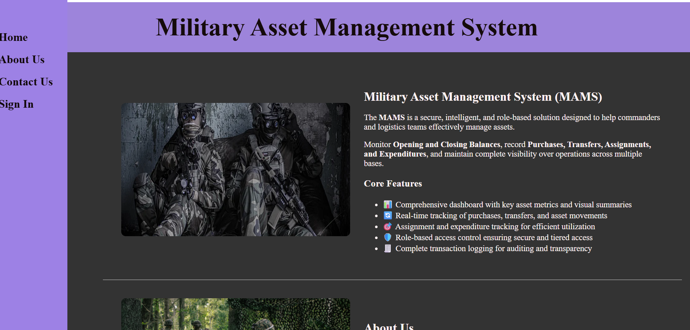
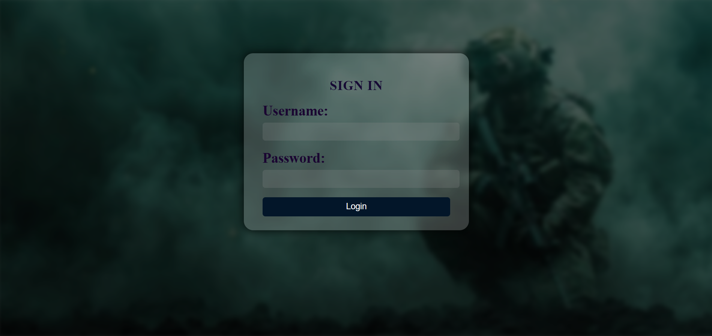
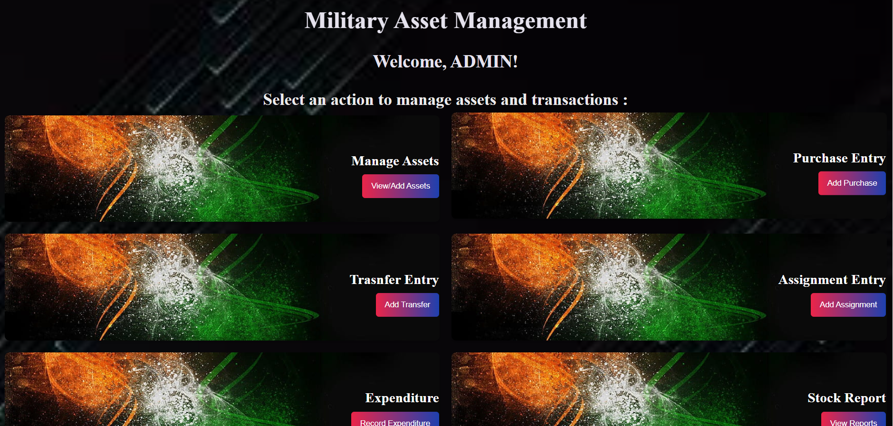
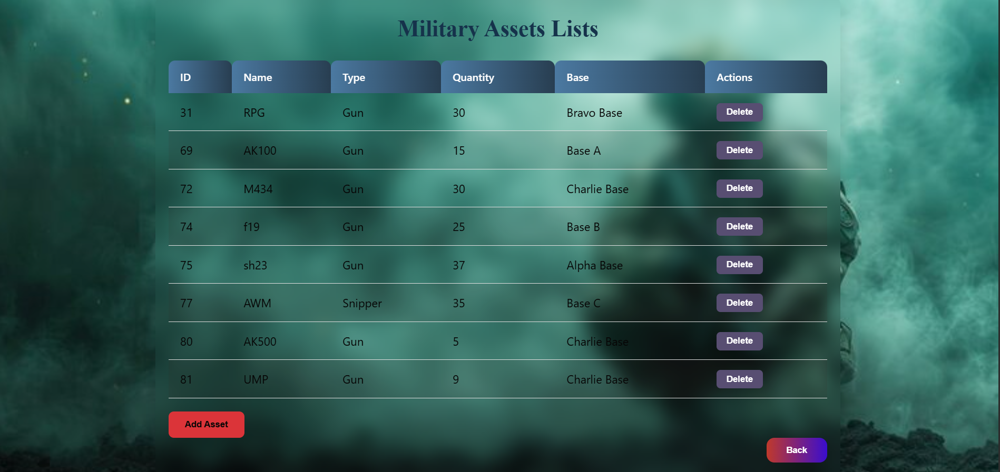
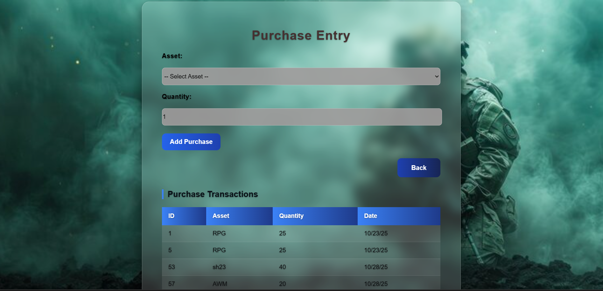
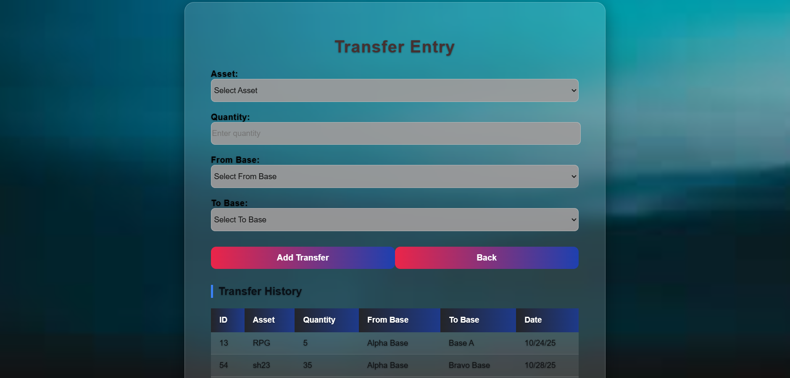
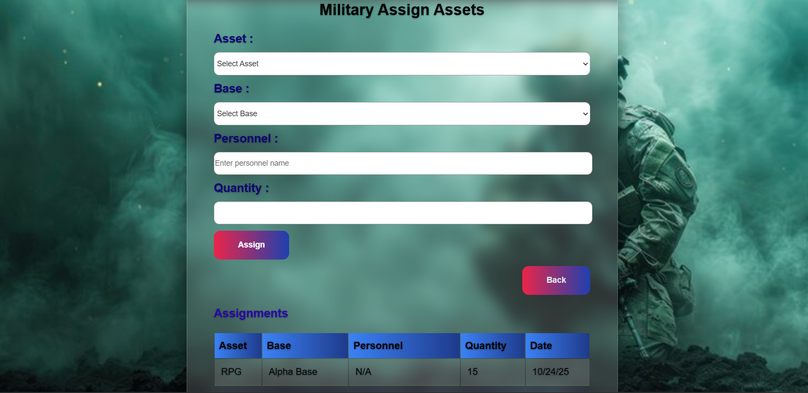
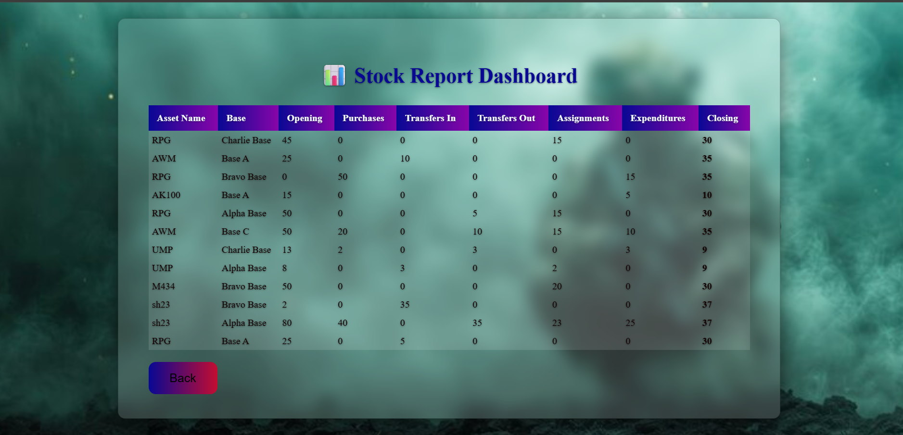

# 🪖 Military Asset Management System

A full-stack web application to manage military assets such as vehicles, weapons, bases, and transactions.

---

## 🚀 Features
- Manage military assets (Add, Edit, Delete)
- Track asset transactions
- User management (Add/Edit/Delete users)
- Generate reports for assets and transactions
- Search and filter functionality

---

## 📁 Project Structure

military/
├── military_asset_frontend/ → Angular Frontend
└── Military_Asset_backend/ → Spring Boot Backend


---

## 🛠️ Tech Stack
**Frontend:** Angular, TypeScript, SCSS  
**Backend:** Java, Spring Boot, Spring Data JPA, Hibernate, MySQL  
**Database:** MySQL  

---

## 💻 How to Run

### Backend (Spring Boot)
```bash
cd Military_Asset_backend
mvn clean install
mvn spring-boot:run
Runs on: http://localhost:8080

Frontend (Angular)
bash
Copy code
cd military_asset_frontend
npm install
ng serve
Runs on: http://localhost:4200

👤 Author
Annappa N
GitHub: https://github.com/anp143


## 📸 Screenshots

### Home Page


### Login Page


### Dashboard Page


### Assets Page



### purchase Page


### transfer Page


### Assignment Page


### Expenditure


### Stock Report



